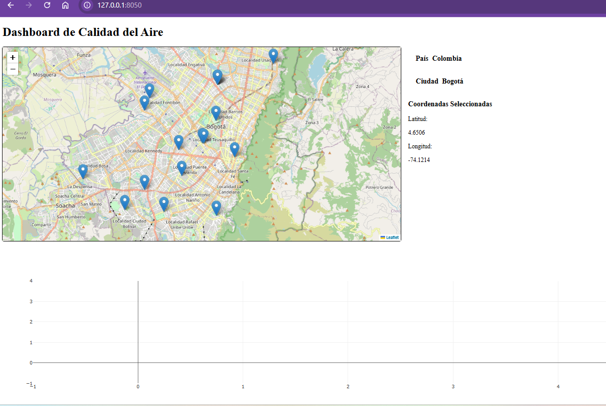
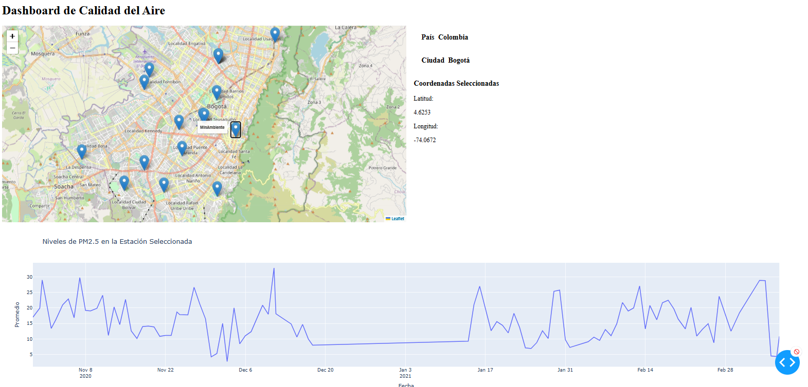
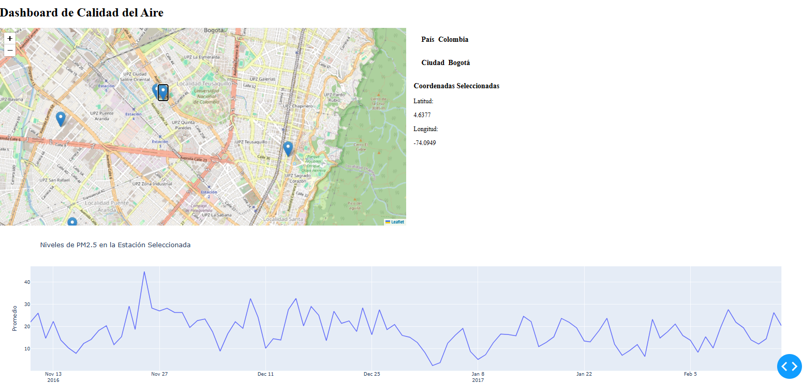

# Dashboard de Calidad del Aire

 <!-- Reemplaza con una imagen real de tu aplicación -->

## Introducción

**Nombre del Proyecto:** Dashboard de Calidad del Aire

**Descripción Breve:**  
Este proyecto es una aplicación interactiva desarrollada en Python que muestra datos de calidad del aire en tiempo real para diversas ciudades de Colombia. Utiliza **Dash** y **Dash Leaflet** para crear un mapa interactivo y gráficos que permiten a los usuarios visualizar y analizar los niveles de contaminación del aire.

## Estructura del Proyecto

El proyecto está organizado en los siguientes archivos principales:

- **app.py**: Contiene la configuración principal de la aplicación Dash, incluyendo el layout y los callbacks para la interacción del usuario.
- **api.py**: Define la clase `AirQualityAPI` para interactuar con la API de OpenAQ y obtener datos sobre la calidad del aire.
- **utils.py**: Incluye funciones auxiliares como `obtener_estaciones` y `obtener_pais` para manejar la lógica relacionada con la ubicación y las estaciones de monitoreo.

## Funcionalidades Clave

- **Mapa Interactivo**: Visualización de un mapa que permite a los usuarios seleccionar ubicaciones y ver datos de calidad del aire en tiempo real.
- **Gráficos de Calidad del Aire**: Generación de gráficos que muestran los niveles de PM2.5 en diferentes ciudades.
- **Integración con OpenAQ**: Conexión con la API de OpenAQ para obtener datos actualizados sobre la calidad del aire.

## Tecnologías Utilizadas

- **Lenguaje de Programación**: Python 3.x
- **Frameworks y Librerías**: 
  - Dash
  - Dash Leaflet
  - Plotly
  - Pandas
  - Requests
- **APIs Externas**:
  - OpenAQ API para datos de calidad del aire.
  - Nominatim de OpenStreetMap para geocodificación inversa.

## Instalación y Configuración

### Requisitos Previos

- Python 3.x instalado en el sistema.

### Instalación de Dependencias

1. Clona este repositorio:
   ```bash
   git clone https://github.com/tu-usuario/dashboard-calidad-aire.git
   cd dashboard-calidad-aire

2. Instala las dependencias necesarias:
    pip install -r requirements.txt

### Configuración de la API

1. Obtén una clave de API de OpenAQ.

2. Configura la clave en el archivo api.py:

3. API_KEY = 'tu_clave_api_aqui'

## Uso de la Aplicación

1. Ejecuta la aplicación:

        python app.py

2. Abre tu navegador y visita http://127.0.0.1:8050/.

3. Interactúa con el mapa para seleccionar ubicaciones y visualizar los datos de calidad del aire.

## Contribución

¡Las contribuciones son bienvenidas! Si deseas contribuir al proyecto, sigue estos pasos:

1. Haz un fork del repositorio.
2. Crea una nueva rama:(git checkout -b feature/nueva-funcionalidad).
3. Realiza tus cambios y haz commit:

    git commit -am 'Añade nueva funcionalidad'.

4. Haz push a la rama:
    git push origin feature/nueva-funcionalidad

5. Abre un Pull Request.

Por favor, asegúrate de seguir los estándares de codificación y de documentar adecuadamente tus cambios.

## Licencia

Este proyecto está bajo la licencia MIT. Para más detalles, consulta el archivo LICENSE.

Contacto
Si tienes alguna pregunta o necesitas soporte, no dudes en contactarme:

Nombre: JHONY MICHAEL DURÁN RAMIREZ

Email: [jhonyd55@gmail.com]

GitHub: Jhonyd55

## Capturas de Pantalla



## Créditos
Colaboradores: [JHONY MICHAEL DURÁN RAMIREZ]

* Recursos Utilizados:

* OpenAQ

* OpenStreetMap

## Estado del Proyecto
## Estado Actual: En desarrollo

##Tabla de Contenidos

1. Introducción

2. Estructura del Proyecto

3. Funcionalidades Clave

4. Tecnologías Utilizadas

5. Instalación y Configuración

6. Uso de la Aplicación

7. Contribución

8. Licencia

9. Contacto

10. Capturas de Pantalla

11. Créditos

12. Estado del Proyecto
    
    
